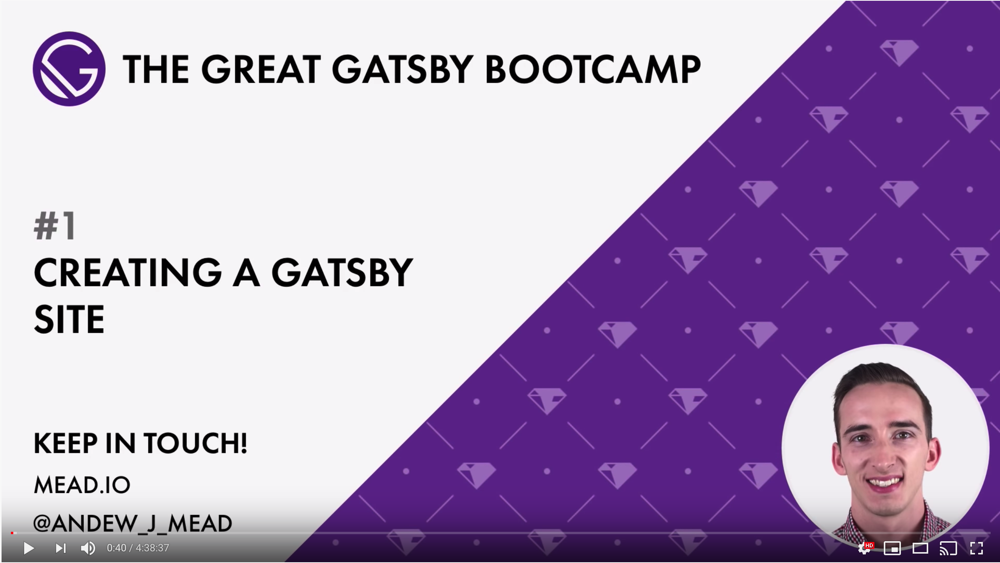

I built this blog following Andrew Mead's 'The Great Gatsby Bootcamp' which you can view on YouTube for free [here](https://www.youtube.com/watch?v=8t0vNu2fCCM).

It is just over 4 and a half hours long but the course is split into 20 chapters and gives you a great overview of Gatsby. I think this course it suitable for beginner developers with some basic HTML, CSS and JS experience looking to learn a little React, GraphQL and NodeJS.

### What is Gatsby JS?

Gatsby is a framework for creating blazing fast websites and web applications. Powered by React and GraphQL, Gatsby gives you everything you need to build and launch your next project.

With Gatsby, you can create:

1. A personal site with a blog powered by markdown.
2. A complex company website powered by a CMS such as Contentful or WordPress.
3. A cutting-edge web application with authentication, data storage, and more.

You can learn more about Gatsby at their official website [here](https://www.gatsbyjs.org/).

Good luck!
